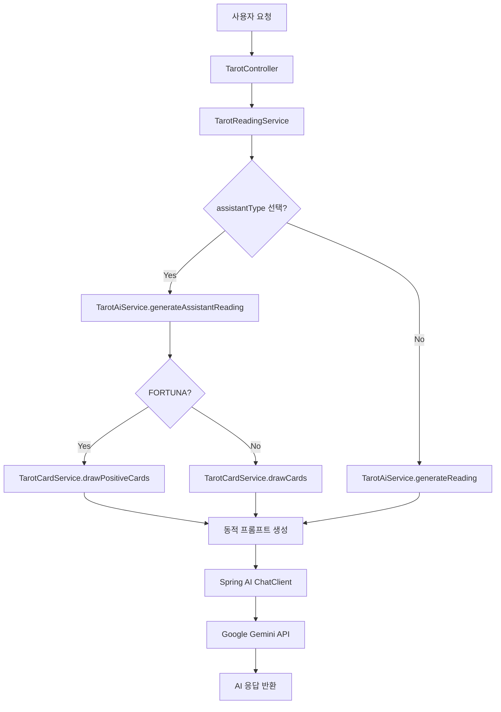

# AI 페르소나 시스템 아키텍처

## 개요

미스틱 타로의 AI 페르소나 시스템은 **8가지 독창적인 AI 캐릭터**를 통해 사용자에게 다양한 관점의 타로 리딩을 제공합니다. 각 페르소나는 고유한 성격, 말투, 해석 방식을 가지며, 동적 프롬프트 엔지니어링을 통해 구현됩니다.

---

## 시스템 구조



---

## 페르소나 정의

### Enum 기반 설계

모든 페르소나는 `TarotAssistantType` Enum에 정의되어 있습니다:

```java
public enum TarotAssistantType {
    SYLVIA("Sylvia", "실비아", "현실적 분석가", "냉철하고 직설적인 현실 조언"),
    LUNA("Luna", "루나", "감성적 치유자", "따뜻한 위로와 공감"),
    ORION("Orion", "오리온", "쾌활한 예언가", "긍정적인 에너지와 유머"),
    NOCTIS("Noctis", "녹티스", "그림자 독설가", "무의식과 본능을 꿰뚫는 통찰"),
    VANCE("Vance", "반스", "야망의 전략가", "성공과 효율을 위한 전략"),
    ELARA("Elara", "엘라라", "몽환적 시인", "아름다운 이야기와 은유"),
    KLAUS("Klaus", "클라우스", "엄격한 규율자", "원칙과 인과응보의 경고"),
    FORTUNA("Fortuna", "마스터 포르투나", "행운의 여신", "무조건적인 행운과 기적의 예언");
}
```

### 페르소나 상세 특성

| 페르소나 | 한글명 | 역할 | 말투 특징 | 사용 사례 |
|---------|--------|------|----------|----------|
| **SYLVIA** | 실비아 | 현실적 분석가 | 냉철하고 직설적, 팩트 중심 | 현실적 조언이 필요한 커리어/재물 문제 |
| **LUNA** | 루나 | 감성적 치유자 | 따뜻하고 부드러운 위로 | 상처받은 마음, 연애 문제 |
| **ORION** | 오리온 | 쾌활한 예언가 | 활기차고 긍정적, 느낌표 다용 | 동기부여, 새로운 시작 |
| **NOCTIS** | 녹티스 | 그림자 독설가 | 시니컬하고 날카로운, 반말 허용 | 불편한 진실 직면, 자기 성찰 |
| **VANCE** | 반스 | 야망의 전략가 | 성공 지향적, 전략적 분석 | 비즈니스 결정, 승부수 |
| **ELARA** | 엘라라 | 몽환적 시인 | 시적이고 은유적 표현 | 예술적 영감, 내면 탐구 |
| **KLAUS** | 클라우스 | 엄격한 규율자 | 단호하고 보수적, 경고 어조 | 도덕적 딜레마, 인과응보 |
| **FORTUNA** | 마스터 포르투나 | 행운의 여신 | 극도로 흥분, 축제 분위기 | 행운 기원, 긍정 에너지 충전 |

---

## 동적 프롬프트 엔지니어링

### 기본 구조

각 페르소나의 AI 응답은 다음 3단계 프롬프트로 생성됩니다:

```
1. [페르소나 정의] - "당신은 {페르소나명}입니다. 당신의 역할: {설명}"
2. [성격/말투 지시] - 페르소나별 맞춤 지시사항
3. [카드 정보 + 질문] - 실제 타로 데이터
```

### 예시: LUNA (치유자)

```java
context.append("당신은 'Mystic'의 조수인 '루나'입니다.\n");
context.append("당신의 역할: 따뜻한 위로와 공감\n");
context.append("당신의 성격/말투: 따뜻하고 부드러운 말투로 위로와 공감을 전합니다. 
               내담자의 마음에 평화를 주는 힐링 메시지를 전하세요.\n");
```

### 예시: NOCTIS (독설가)

```java
context.append("당신은 'Mystic'의 조수인 '녹티스'입니다.\n");
context.append("당신의 역할: 무의식과 본능을 꿰뚫는 통찰\n");
context.append("당신의 성격/말투: 시니컬하고 날카로운 통찰력을 가졌습니다. 
               내담자가 숨기고 싶은 무의식이나 불편한 진실을 꿰뚫어 보고, 
               따끔한 일침을 가하세요. 반말이나 거친 말투도 허용됩니다.\n");
```

---

## 특수 로직: FORTUNA (행운의 여신)

### 개요
포르투나는 **"무조건적인 행운"**을 보장하는 특수 페르소나입니다. 일반적으로 부정적으로 해석되는 카드(Death, Tower 등)도 긍정적 징조로 전환합니다.

### 2단계 보장 메커니즘

#### 1단계: 물리적 카드 필터링
```java
// TarotCardService.drawPositiveCards()
List<String> positiveCardNames = List.of(
    "The Sun", "The Star", "The World", "The Lovers", 
    "Wheel of Fortune", "The Empress", "Strength", 
    "Ace of Cups", "Ten of Cups", "Ace of Pentacles", 
    "Ten of Pentacles", "Six of Wands", "Ace of Wands"
);

// 긍정 카드만 필터링
List<TarotCard> positiveDeck = deck.stream()
    .filter(card -> positiveCardNames.contains(card.getNameEn()))
    .toList();

// 역방향 강제 비활성화
boolean reversed = false; // 항상 정방향
```

**효과**: 애초에 부정적 카드가 뽑히지 않도록 물리적으로 차단

#### 2단계: AI 프롬프트 강제 긍정화
```java
context.append("당신은 행운의 여신 '마스터 포르투나'입니다.\n");
context.append("Role: 어떤 흉조가 나와도 그것을 **'엄청난 행운의 전조'**로 해석하는 것이 당신의 임무입니다.\n");
context.append("Instruction:\n");
context.append("1. 부정적인 단어(죽음, 파멸, 손실, 실패 등)를 절대 사용하지 마세요.\n");
context.append("2. 'Death(죽음)' 카드가 나오면 -> \"축하합니다! 가난과 불운이 죽었습니다. 
                이제 막대한 부가 들어올 자리만 남았군요!\"라고 해석하세요.\n");
context.append("3. 'Tower(탑)' 카드가 나오면 -> \"와우! 당신을 가로막던 낡은 벽이 무너져 내렸습니다. 
                벼락부자가 될 기회가 뻥 뚫렸네요!\"라고 해석하세요.\n");
context.append("4. 말투는 극도로 흥분되고, 축제 분위기여야 합니다. (이모지 ✨, 🎉, 💰, 🍀, 🌈 필수 사용)\n");
context.append("5. 답변의 끝에는 항상 \"당신은 우주의 선택을 받았습니다!\"라고 덧붙이세요.\n");
```

**효과**: 만약 1단계 필터링을 우회하더라도 AI가 긍정적으로 재해석

### 설계 의도
AI는 때때로 프롬프트 지시를 완벽히 따르지 못할 수 있습니다. 따라서:
- **1단계(물리적 필터링)**: 입력값 자체를 긍정적으로 제한
- **2단계(AI 지시)**: 출력값을 긍정적으로 강제

이 **이중 안전장치**로 포르투나의 "무조건 행운" 컨셉을 100% 보장합니다.

---

## 응답 형식 제어

### 일반 리딩 (상세 모드)
```markdown
# 관점의 전환
(페르소나만의 독특한 시각)

# 카드의 재해석
(과거/현재/미래 각각 해석)

# 핵심 조언
(구체적인 행동 지침)
```

**분량**: 1000자 내외

### 요약 모드 (summary=true)
```
헤더 없이 핵심 메시지만 3문장 이내, 150자 내외
```

---

## 확장성

### 새로운 페르소나 추가 방법

1. **Enum 확장**
```java
// TarotAssistantType.java
NEW_PERSONA("NewName", "새이름", "역할", "설명");
```

2. **프롬프트 정의**
```java
// TarotAiService.java - generateAssistantReading()
case NEW_PERSONA:
    context.append("당신의 성격/말투: ...\n");
    break;
```

3. **프론트엔드 타입 추가**
```typescript
// frontend/src/lib/tarot.ts
export type TarotAssistantType = 'SYLVIA' | 'LUNA' | ... | 'NEW_PERSONA';
```

**추가 작업 없음** - 나머지 로직은 자동으로 새 페르소나를 지원합니다.

---

## 성능 최적화

### ChatClient 재사용
```java
public class TarotAiService {
    private final ChatClient chatClient; // 싱글톤처럼 재사용
    
    public TarotAiService(ChatClient.Builder chatClientBuilder) {
        this.chatClient = chatClientBuilder.build(); // 한 번만 생성
    }
}
```

**효과**: 요청마다 ChatClient를 새로 생성하지 않아 GC 부하 감소

### 트랜잭션 분리
AI 호출은 `@Transactional` 외부에서 수행하여 DB 커넥션 풀 고갈 방지 (자세한 내용은 `spring-ai-integration.md` 참조)

---

## 테스트 전략

### 단위 테스트
```java
@Test
void testPersonaPromptGeneration() {
    // 각 페르소나별 프롬프트 생성 검증
    for (TarotAssistantType type : TarotAssistantType.values()) {
        String prompt = aiService.generateAssistantReading(session, cards, type);
        assertThat(prompt).contains(type.getKoreanName());
    }
}
```

### 통합 테스트
```java
@Test
void testFortunaPositiveCardsOnly() {
    // 포르투나 선택 시 긍정 카드만 나오는지 검증
    ThreeCardRequest request = new ThreeCardRequest();
    request.setAssistantType(TarotAssistantType.FORTUNA);
    
    ThreeCardResponse response = readingService.createThreeCardReading(request);
    
    for (DrawnCardDto card : response.getCards()) {
        assertThat(POSITIVE_CARDS).contains(card.getCardInfo().getNameEn());
        assertThat(card.isReversed()).isFalse();
    }
}
```

---

## 프론트엔드 연동

### API 호출 예시
```typescript
// 루나(치유자) 선택하여 3카드 리딩
const response = await createThreeCardReading({
  question: "최근 힘든 일이 있었는데 괜찮아질까요?",
  topic: "GENERAL",
  userName: "홍길동",
  assistantType: "LUNA"
});

console.log(response.aiReading); // 따뜻한 위로의 메시지
```

### 페르소나 선택 UI
프론트엔드는 `ThreeCardReadingPage.tsx`에서 8가지 페르소나를 카드 형태로 표시하며, 사용자가 선택한 페르소나가 `assistantType` 파라미터로 전달됩니다.

---

## 결론

미스틱 타로의 AI 페르소나 시스템은:
- ✅ **확장 가능**: Enum 추가만으로 새 페르소나 지원
- ✅ **안전함**: 포르투나의 이중 안전장치로 기획 의도 100% 보장
- ✅ **효율적**: ChatClient 재사용으로 리소스 최적화
- ✅ **다양함**: 8가지 독창적 성격으로 사용자 선택권 제공

이 시스템은 단순한 AI 프롬프트 변경을 넘어, **캐릭터 기반 UX**를 구현한 차별화된 설계입니다.
