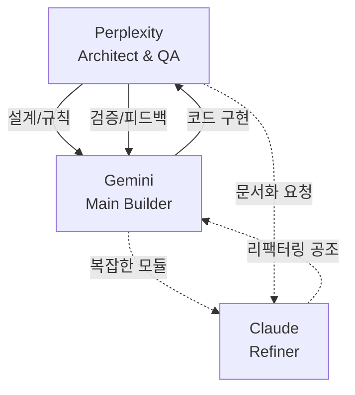

# 🚀 AI 협업 표준 가이드 (Perplexity + Gemini + Claude)

이 가이드는 **Perplexity의 설계/검수 능력**, **Gemini(Antigravity)의 에이전틱 구현 능력**, **Claude의 리팩터링/문서화 능력**을 결합하여, **모든 도메인에서 일정한 고퀄리티를 달성**하기 위한 협업 헌법입니다.

> [!NOTE]
> 이 문서는 프로젝트의 **'Single Source of Truth'** 역할을 합니다. 모호함이 생길 때마다 이 가이드를 기준으로 판단하세요.

---

## 1. 👥 AI 모델별 핵심 역할 (R&R)

| Role | Model | Description | Key Artifacts |
| :--- | :--- | :--- | :--- |
| **Architect & QA** (Control Tower) | **Perplexity** | • **설계 주도**: 기술 스택 선정, DB 스키마/API 명세 작성 • **규칙 관리**: 프로젝트 헌법(Coding Convention 등) 수립 • **품질 보증**: 구현 코드 리뷰, 테스트 케이스 설계, 보안 점검 | `design_spec.md` `collaborations_rule.md` `checklist.md` |
| **Main Builder** (IDE Specialist) | **Gemini** (Antigravity) | • **Agentic Workflow**: [Planning → Execution → Verification] 루프 수행 • **실전 구현**: IDE 내 파일 생성/수정, 패키지 설치, 터미널 제어 • **상태 추적**: 작업 단위(`task.md`) 관리 및 실시간 코딩 | `implementation_plan.md` `task.md` `walkthrough.md` **Source Code** |
| **Refiner & Editor** (Polisher) | **Claude** | • **고도화**: 대규모 리팩터링, 아키텍처 구조 개선 • **문서화**: Readme, API Docs 등 상세 문서 작성 • **Vibe Coding**: 자연어 뉘앙스를 살린 코드 스타일링 | Refactored Modules Technical Docs |

---

## 2. 🔄 Collaboration Loop (설계–구현–검증 파이프라인)

퀄리티 유지를 위해 **[설계(Perplexity) → 구현(Gemini) → 검증(Perplexity)]**의 루프를 철저히 준수합니다.

### Step 1. [Design] The Blueprint (by Perplexity)
*   **Action**: 작업 시작 전, 무조건 설계를 먼저 확정합니다. 코딩부터 하지 않습니다.
*   **Prompt**: "이 프로젝트 목표는 X야. Y 기능을 위한 **DB 스키마, API 명세, 에러 처리 규칙**을 담은 `design_spec.md`를 작성해줘."
*   **Outcome**: 
    - `design_spec.md` (설계도)
    - `collaborations_rule.md` (프로젝트 헌법 업데이트)

> [!IMPORTANT]
> 설계 단계에서 **예외 처리(Error Handling)**와 **데이터 검증(Validation)** 규칙을 명확히 정의해야 나중에 코드가 꼬이지 않습니다.

### Step 2. [Build] The Muscle (by Gemini / Antigravity)
*   **Action**: 설계서를 바탕으로 IDE에서 **Agentic Workflow**를 수행합니다.
*   **Multi-Agent Mode**: Gemini는 필요에 따라 아래와 같이 역할을 나누어 수행한다고 가정합니다.
    -   🤖 **Coding Agent**: 실제 기능 구현 (Main)
    -   🧪 **Testing Agent**: 테스트 코드 작성 및 자동 실행, 리포트 생성
    -   📝 **Doc Agent**: `walkthrough.md` 업데이트 및 API 문서화
*   **Workflow**:
    1.  **Planning**: `implementation_plan.md` 작성 (설계서 준수 체크)
    2.  **Execution**: `task.md`를 쪼개 가며 하나씩 구현
    3.  **Verification**: 자체 테스트 및 `walkthrough.md`에 검증 결과 기록

### Step 3. [Review] The Auditor (by Perplexity)
*   **Action**: 구현된 코드를 Perplexity에게 보내 **냉철한 검증**을 받습니다.
*   **Risk Check**: 위험도가 높은 도메인은 **별도 체크리스트**를 요청하여 검증합니다.
    -   🔐 `checklist_security.md`: 인증/인가, 암호화, 개인정보
    -   💳 `checklist_payment.md`: 트랜잭션 무결성, 중복 결제 방지
    -   🎛️ `checklist_hardware.md`: 센서 예외 처리, 타임아웃, 재연결 로직
*   **Prompt**: "이 코드가 초기 설계서(`design_spec.md`)와 체크리스트(`checklist_security.md`)를 준수했어?"

---

## 3. 📜 Project Constitution (프로젝트 헌법)

모든 AI와의 대화 시작 전 **반드시 주입해야 하는 공통 규칙**입니다. `collaborations_rule.md`에 저장하고 관리하세요.

### 🏛️ Architecture & Code Style
*   **Arch**: Layered Architecture (Controller ↔ Service ↔ Repository) 준수
*   **Naming**: 
    - Java/TS: `camelCase` (변수/함수), `PascalCase` (클래스)
    - Python/DB: `snake_case`
*   **Comments**: "Why"에 집중한 주석 작성 (What은 코드만 봐도 앎)

### 🛡️ Error Handling & Security
*   **Response**: 모든 API는 공통 포맷 사용 `Context { success, data, error: { code, message } }`
*   **Validation**: Controller/Input 레벨에서 1차 검증, Domain에서 2차 검증 필수
*   **Security**: 하드코딩된 Secret 절대 금지 (`.env` 사용)

### 🧪 Testing Policy
*   **Rule**: "테스트 없는 코드는 레거시(Legacy)다."
*   **Minimum**: 주요 비즈니스 로직에 대해 **Unit Test 최소 1개** 작성
*   **Check**: 배포 전 `npm test` 또는 `pytest` 통과 필수

---

## 4. 📊 Metrics & Evaluation (지속적 개선)

단순히 "구현했다"에 그치지 않고, 팀 단위(또는 1인 개발)의 퀄리티를 유지하기 위해 아래 지표를 주기적으로 확인합니다.

| Metric | Description | Goal |
| :--- | :--- | :--- |
| **Bug Recurrence** | QA/Review 후 동일한 버그가 다시 발생하는 횟수 | 0회 (발생 시 `collaborations_rule.md` 업데이트) |
| **Test Coverage** | 주요 비즈니스 로직의 테스트 커버리지 | 80% 이상 권장 |
| **One-Shot Success** | 테스크 완료 후 수정 없이 한 번에 통과하는 비율 | 점진적 상승 목표 |

---

## 5. 🗣️ Prompting Tips (Vibe Coding)

"개떡같이 말해도 찰떡같이 알아듣게" 하려면 **구체적인 명사**와 **시각적 묘사**를 쓰세요.

| Bad Prompt ❌ | Good Prompt ✅ | Effect |
| :--- | :--- | :--- |
| "거기 좀 고쳐줘" | "**헤더**의 **로그인 버튼** 크기를 16px로 줄여줘" | 위치/대상 명확화 |
| "쇼핑몰 만들어줘" | "1. **상품 목록** API부터 짜자. 2. 그 다음 **장바구니** 붙이자." | 단계적 사고 유도 |
| "좀 예쁘게 해봐" | "Primary Color는 **#3B82F6**, 버튼은 **Rounded-lg**로 해줘" | 디자인 시스템 적용 |

> [!TIP]
> **"단계별 확인"**이 핵심입니다. 한 번에 너무 많은 것을 시키면 AI도 실수를 합니다. "일단 1번만 하고 멈춰서 보여줘"라고 하세요.

---

## 6. 📅 Daily Routine (Project Lifecycle)

1.  **🌅 Morning (Plan)**: Perplexity와 `Today’s Task Spec` 작성 (오늘 뭐 할지, 리스크 뭔지)
2.  **☀️ Day (Execute)**: Gemini(Antigravity)와 함께 **몰입 코딩** (Coding ↔ Testing 모드 전환)
3.  **🌇 Afternoon (Refine)**: 복잡하면 Claude에게 "이거 좀 깔끔하게 정리해줘" (Refactoring)
4.  **🌙 Evening (Review)**: Perplexity에게 "오늘 코드 어때? 내일 뭐 할까?" (Review & Retrospective)

> [!WARNING]
> **설계 변경**이 생기면 코드부터 고치지 말고, 반드시 **Perplexity에서 설계서(`design_spec.md`)를 먼저 수정**하고 다시 구현 단계로 내려오세요. 문서와 코드의 불일치는 재앙의 시작입니다.
